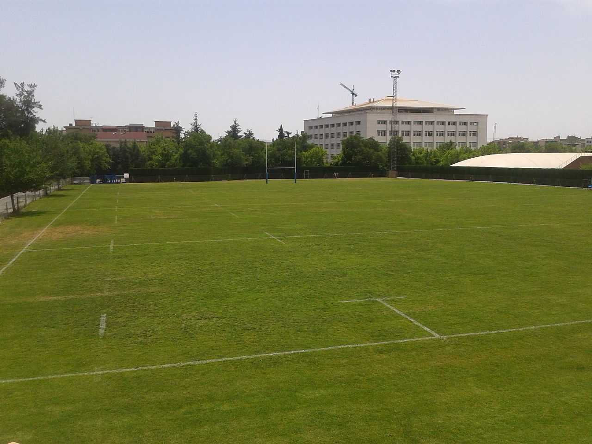

# VC - Práctica 1
##### Luis Martín Pérez y Andrea Santana López

---

### Descripción general

El cuaderno con la resolución de las tareas es [**entrega.ipynb**](entrega.ipynb). Los ejercicios realizados son los siguientes:
1. Tablero de ajedrez
2. Imagen estilo mondrian
3. Modificar los planos de color de la imagen
4. Encontrar el pixel más claro y más oscuro de una imagen
5. Propuesta de Pop art: Minecraft

### Tarea 1: Tablero de ajedrez 
Lo realizamos utilizando un bucle doble donde teniendo en cuenta si la fila es par o impar ponemos cuadros
en las columnas pares o impares
    

### Tarea 2: Imagen estilo mondrian
Lo realizamos utilizando funciones de la libreria opencv y usando medidas aproximadas para realizar las 
figuras geometricas 
    

### Tarea  3:Modificar los planos de color de la imagen

### Tarea  4: Encontrar el pixel más claro y más oscuro de una imagen
Lo realizamos examinamos cada pixel su RGB e ir comprobando al sumar las tres cantidades de RGB si es mayor que sería el más claro
y el más oscuro el más aproximado a 0
    
### Tarea  5: Propuesta de Pop art: Minecraft

### Librerías
Las librerías usadas para la resolución son las siguientes:

- `opencv` - Procesamiento de imágenes
- `numpy` - Simplificar procesos matemáticos
- `matplot` - Para representar imágenes dentro del cuaderno  
- `os` - Para recorrer los archivos de un directorio

### Referencias
Las referencias a imágenes y/o información usada son las siguientes:
#### Imágenes
- **Mondrian:** [*Composition II in Red Blue and Yellow - Piet Mondrian*](https://en.wikipedia.org/wiki/Piet_Mondrian#/media/File:Piet_Mondriaan,_1930_-_Mondrian_Composition_II_in_Red,_Blue,_and_Yellow.jpg)
- **Bloques de minecraft:** [*List of block textures - Minecraft wiki*](https://minecraft.fandom.com/wiki/List_of_block_textures)

#### Información
- **Algoritmos de redimensión de imágenes**: [*Comparison gallery of image scaling algorithms - Wikipedia*](https://en.wikipedia.org/wiki/Comparison_gallery_of_image_scaling_algorithms)
- **Guía para calcular distancia Euclidiana con `numpy`**: [Calculate the euclidean distance using numpy - Geeks for Geeks](https://www.geeksforgeeks.org/python/calculate-the-euclidean-distance-using-numpy/)
- **Guía para la magia de `numpy`**: [Vectorized operations in numpy - Geeks for Geeks](https://www.geeksforgeeks.org/numpy/vectorized-operations-in-numpy/)
